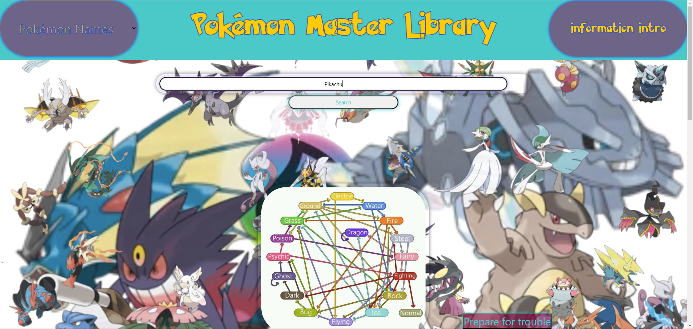
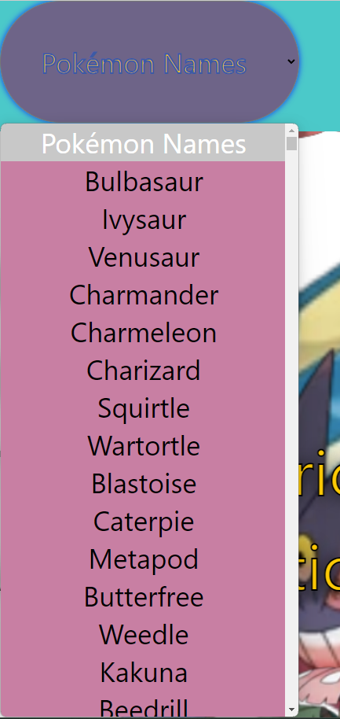
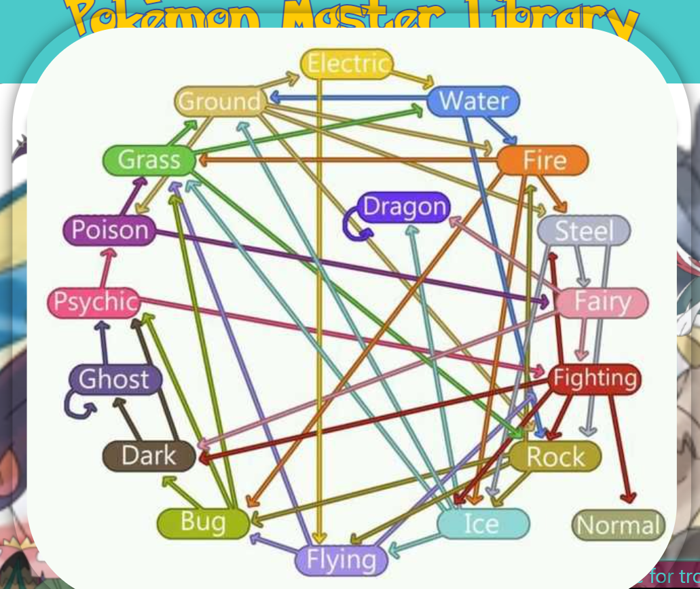

# Pokemon-Master-Library

## Description

Motivation:

We all love pokemon! We wanted to inspire and encourage others who are new to the pokemon community, to help them better understand the pokemons they are battling with and against. And for the people who’ve grown up with pokemon, we have easter eggs featuring yours truly, TEAM ROCKET!

Desciption:

The user can choose from a drop-down list of pokemon names or search for a pokemon of their choosing. After clicking on the search button, the user will be presented with various information on their target pokemon. Also, if the user needs advice we have an informative chart explaining the strengths and weaknesses of all pokemon types, as well as, advice from TEAM ROCKET! Press on the PREPARE FOR TROUBLE BUTTON for some amazing, fun, and outlandish quotes from the infamous TEAM ROCKET!

## Installation

Proceed to the webpage here | [Pokemon Master Library](https://lorenzo-olivar.github.io/Pokemon-Master-Library/)

## Usage

In the search bar, you can type the name of the Pokemon that you want to learn more about.

When you click the search bar, the information of the Pokemon you searched for will pop up!

If you don't know a name to search for, you use the Pokemon name dropdown to the left.

We also provide additional information about our website located on the top right button.

In the center of our landing page, we also provide an in-depth poke-type chart that displays the strengths and weaknesses of each type.

FOR A FUN EASTER EGG O.O PRESS THIS BUTTON!!!

## Credits

[PokeAPI](https://pokeapi.co/)

[Advice Slip API](https://api.adviceslip.com/)

## License
none
